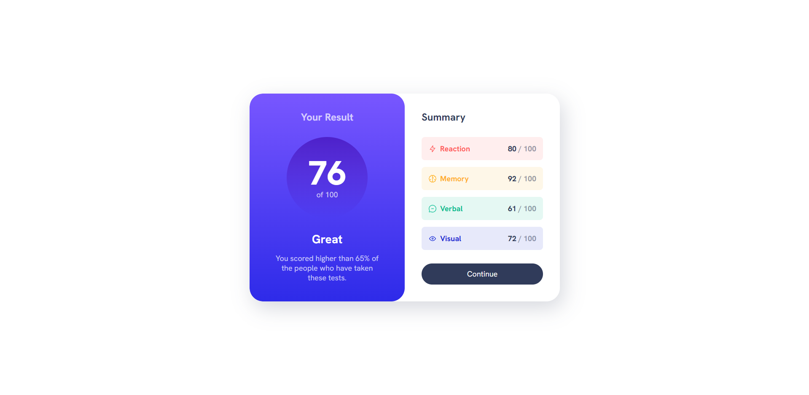

# Frontend Mentor - Results summary component solution

This is a solution to the [Results summary component challenge on Frontend Mentor](https://www.frontendmentor.io/challenges/results-summary-component-CE_K6s0maV). Frontend Mentor challenges help you improve your coding skills by building realistic projects. 

## Table of contents

- [Overview](#overview)
  - [The challenge](#the-challenge)
  - [Screenshot](#screenshot)
  - [Links](#links)
- [My process](#my-process)
  - [Built with](#built-with)
  - [What I learned](#what-i-learned)
  - [Continued development](#continued-development)
  - [Useful resources](#useful-resources)
- [Author](#author)

## Overview

### The challenge

Users should be able to:

- View the optimal layout depending on their device's screen size

### Screenshot

### Links

- Solution URL: [https://www.frontendmentor.io/solutions/responsive-results-summary-component-created-with-grid-p7WLCBxhxB]
- Live Site URL: [https://lucianioan31.github.io/results-summary-component/]

## My process

### Built with

- Semantic HTML5 markup
- CSS custom properties
- Grid
- relative units
- linear-gradient background
- media queries
- data atributes selector

**Note: These are just examples. Delete this note and replace the list above with your own choices**

### What I learned

[data-spacing] - A new thing for me and it is very usefull
[@font-face] - a new way for me to use a text font
[custom-properties] - practiced custom properties
I think I found a way of code reseting from now one
I have understand that is better to style some elements inside a media query in order to get it as you want for the larger screens. Until now I was styling the elements for the larger screens and then using a media query so they can look 'default' on little screens. Lol, what was I doing? -_-

### Continued development

I struggled a lot in finding the best sizes of the containers, padding, margin and fonts. Using percentages is difficult at the moment. I got a lot of frustration when on a regular window it was looking ok, but maximizing the browser's window was making me design look ugly in different ways: or too large, or too stretched or the main container broken. This is something I need to learn. 

### Useful resources

- [Example resource 1](https://www.w3schools.com/cssref/css3_pr_box-shadow.php) - I looked here for that shadow thing;
## Author

- Frontend Mentor - [@LucianIoan31](https://www.frontendmentor.io/profile/LucianIoan31)

## Acknowledgments

Thanks Kevin Powell for his video on this solution [https://www.youtube.com/watch?v=KqFAs5d3Yl8]
